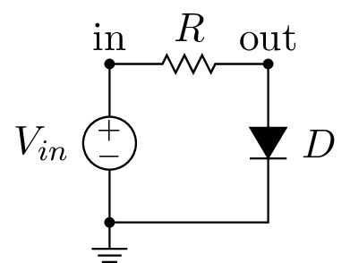
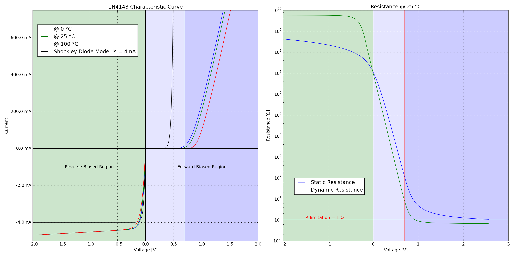

.. include:: /project-links.txt
.. include:: /abbreviation.txt

============================
 Diode Characteristic Curve
============================

.. getthecode:: diode-characteristic-curve.py
    :language: python

This example shows how to simulate and plot the characteristic curve of a diode.

.. code-block:: python

    import os
    
    import numpy as np
    import matplotlib.pyplot as plt
    import matplotlib.ticker as ticker
    
    import PySpice.Logging.Logging as Logging
    logger = Logging.setup_logging()
    
    from PySpice.Spice.Netlist import Circuit
    from PySpice.Spice.Library import SpiceLibrary
    from PySpice.Unit.Units import *
    from PySpice.Physics.SemiConductor import ShockleyDiode
    
    libraries_path = os.path.join(os.environ['PySpice_examples_path'], 'libraries')
    spice_library = SpiceLibrary(libraries_path)
    

For this purpose, we use the common high-speed diode 1N4148.  The diode is driven by a variable
voltage source through a limiting current resistance.  And We will simulate the circuit at these
temperatures: 0, 25 and 100 °C.

.. code-block:: python

    circuit = Circuit('Diode Characteristic Curve')
    
    circuit.include(spice_library['1N4148'])
    
    circuit.V('input', 'in', circuit.gnd, '10V')
    circuit.R(1, 'in', 'out', 1) # not required for simulation
    circuit.X('D1', '1N4148', 'out', circuit.gnd)
    
    temperatures = [0, 25, 100]
    analyses = {}
    for temperature in temperatures:
        simulator = circuit.simulator(temperature=temperature, nominal_temperature=temperature)
        analysis = simulator.dc(Vinput=slice(-2, 5, .01))
        analyses[temperature] = analysis
    

We plot the characteristic curve and compare them to the Shockley diode model:

.. math::

    I_d = I_s \left( e^{\frac{V_d}{n V_T}} - 1 \right)

where :math:`V_T = \frac{k T}{q}`

In order to scale the reverse biased region, we have to do some hack with Matplotlib.

.. code-block:: python

    silicon_forward_voltage_threshold = .7
    
    shockley_diode = ShockleyDiode(Is=4e-9, degree=25)
    
    def two_scales_tick_formatter(value, position):
        if value >= 0:
            return '{} mA'.format(value)
        else:
            return '{} nA'.format(value/100)
    formatter = ticker.FuncFormatter(two_scales_tick_formatter)
    
    figure = plt.figure(1, (20, 10))
    
    axe = plt.subplot(121)
    axe.set_title('1N4148 Characteristic Curve ')
    axe.set_xlabel('Voltage [V]')
    axe.set_ylabel('Current')
    axe.grid()
    axe.set_xlim(-2, 2)
    axe.axvspan(-2, 0, facecolor='green', alpha=.2)
    axe.axvspan(0, silicon_forward_voltage_threshold, facecolor='blue', alpha=.1)
    axe.axvspan(silicon_forward_voltage_threshold, 2, facecolor='blue', alpha=.2)
    axe.set_ylim(-500, 750) # Fixme: round
    axe.yaxis.set_major_formatter(formatter)
    Vd = analyses[25].out
    # compute scale for reverse and forward region
    forward_region = Vd >= 0
    reverse_region = np.invert(forward_region)
    scale =  reverse_region*1e11 + forward_region*1e3
    for temperature in temperatures:
        analysis = analyses[temperature]
        axe.plot(Vd, - analysis.Vinput * scale)
    axe.plot(Vd, shockley_diode.I(Vd) * scale, 'black')
    axe.legend(['@ {} °C'.format(temperature)
                for temperature in temperatures] + ['Shockley Diode Model Is = 4 nA'],
               loc=(.02,.8))
    axe.axvline(x=0, color='black')
    axe.axhline(y=0, color='black')
    axe.axvline(x=silicon_forward_voltage_threshold, color='red')
    axe.text(-1, -100, 'Reverse Biased Region', ha='center', va='center')
    axe.text( 1, -100, 'Forward Biased Region', ha='center', va='center')
    

Now we compute and plot the static and dynamic resistance.

.. math::

  \frac{d I_d}{d V_d} = \frac{1}{n V_T}(I_d + I_s)

.. math::

  r_d = \frac{d V_d}{d I_d} \approx \frac{n V_T}{I_d}

.. code-block:: python

    axe = plt.subplot(122)
    axe.set_title('Resistance @ 25 °C')
    axe.grid()
    axe.set_xlim(-2, 3)
    axe.axvspan(-2, 0, facecolor='green', alpha=.2)
    axe.axvspan(0, silicon_forward_voltage_threshold, facecolor='blue', alpha=.1)
    axe.axvspan(silicon_forward_voltage_threshold, 3, facecolor='blue', alpha=.2)
    analysis = analyses[25]
    static_resistance = -analysis.out / analysis.Vinput
    dynamic_resistance = np.diff(-analysis.out) / np.diff(analysis.Vinput)
    axe.semilogy(analysis.out, static_resistance, basey=10)
    axe.semilogy(analysis.out[10:-1], dynamic_resistance[10:], basey=10)
    axe.axvline(x=0, color='black')
    axe.axvline(x=silicon_forward_voltage_threshold, color='red')
    axe.axhline(y=1, color='red')
    axe.text(-1.5, 1.1, 'R limitation = 1 Ω', color='red')
    axe.legend(['{} Resistance'.format(x) for x in ('Static', 'Dynamic')], loc=(.05,.2))
    axe.set_xlabel('Voltage [V]')
    axe.set_ylabel('Resistance [Ω]')
    
    plt.tight_layout()
    plt.show()
    

We observe the forward voltage threshold increase with the temperature.
