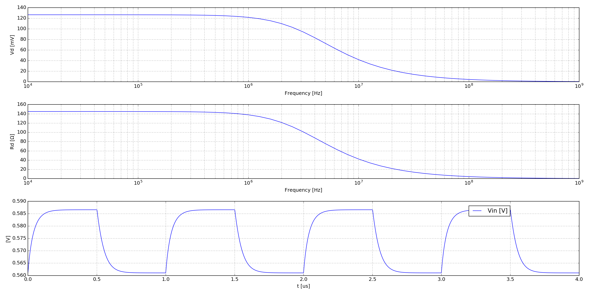

.. include:: /project-links.txt
.. include:: /abbreviation.txt

=====================
 Diode Recovery Time
=====================

.. getthecode:: diode-recovery-time.py
    :language: python

.. code-block:: python

    import os
    
    import numpy as np
    import matplotlib.pyplot as plt
    
    import PySpice.Logging.Logging as Logging
    logger = Logging.setup_logging()
    
    from PySpice.Probe.Plot import plot
    from PySpice.Spice.Library import SpiceLibrary
    from PySpice.Spice.Netlist import Circuit
    from PySpice.Unit.Units import *
    
    libraries_path = os.path.join(os.path.dirname(os.path.dirname(__file__)), 'libraries')
    spice_library = SpiceLibrary(libraries_path)
    
    dc_offset = 1
    ac_amplitude = .1
    
    circuit = Circuit('Diode')
    circuit.include(spice_library['BAV21'])
    source = circuit.V('input', 'in', circuit.gnd, dc_offset)
    circuit.R(1, 'in', 'out', kilo(1))
    circuit.D('1', 'out', circuit.gnd, model='BAV21')
    
    quiescent_points = []
    for voltage in (dc_offset - ac_amplitude, dc_offset, dc_offset + ac_amplitude):
        source.dc_value = voltage
        simulator = circuit.simulator(temperature=25, nominal_temperature=25)
        analysis = simulator.operating_point()
        quiescent_voltage = float(analysis.out)
        quiescent_current = - float(analysis.Vinput)
        quiescent_points.append(dict(voltage=voltage,
                                     quiescent_voltage=quiescent_voltage, quiescent_current=quiescent_current))
        print("Quiescent {:.1f} mV {:.1f} mA".format(quiescent_voltage*1e3, quiescent_current*1e3))
    dynamic_resistance = ((quiescent_points[0]['quiescent_voltage'] - 
                           quiescent_points[-1]['quiescent_voltage'])
                          /
                          (quiescent_points[0]['quiescent_current'] -
                           quiescent_points[-1]['quiescent_current']))
    
    print("Dynamic Resistance", dynamic_resistance)
    
    circuit = Circuit('Diode')
    circuit.include(spice_library['BAV21'])
    circuit.Sinusoidal('input', 'in', circuit.gnd,
                       dc_offset=dc_offset, offset=dc_offset,
                       amplitude=ac_amplitude)
    R = circuit.R(1, 'in', 'out', kilo(1))
    circuit.D('1', 'out', circuit.gnd, model='BAV21')
    
    simulator = circuit.simulator(temperature=25, nominal_temperature=25)
    analysis = simulator.ac(start_frequency=kilo(10), stop_frequency=giga(1), number_of_points=10,  variation='dec')
    
    figure = plt.figure(1, (20, 10))
    
    axe = plt.subplot(311)
    axe.semilogx(analysis.frequency, np.absolute(analysis.out)*1e3)
    axe.grid(True)
    axe.grid(True, which='minor')
    axe.set_xlabel("Frequency [Hz]")
    axe.set_ylabel("Vd [mV]")
    
    axe = plt.subplot(312)
    current = (analysis['in'] - analysis.out) / float(R.resistance)
    axe.semilogx(analysis.frequency, np.absolute(analysis.out/current))
    axe.grid(True)
    axe.grid(True, which='minor')
    axe.set_xlabel("Frequency [Hz]")
    axe.set_ylabel('Rd [Ω]')
    
    frequency = Frequency(mega(1))
    
    circuit = Circuit('Diode')
    circuit.include(spice_library['BAV21'])
    # source = circuit.Sinusoidal('input', 'in', circuit.gnd,
    #                             dc_offset=dc_offset, offset=dc_offset,
    #                             amplitude=ac_amplitude,
    #                             frequency=frequency)
    source = circuit.Pulse('input', 'in', circuit.gnd,
                           initial_value=dc_offset-ac_amplitude, pulsed_value=dc_offset+ac_amplitude,
                           pulse_width=frequency.period/2., period=frequency.period)
    circuit.R(1, 'in', 'out', kilo(1))
    circuit.D('1', 'out', circuit.gnd, model='BAV21')
    
    simulator = circuit.simulator(temperature=25, nominal_temperature=25)
    analysis = simulator.transient(step_time=source.period/1e3, end_time=source.period*4)
    
    axe = plt.subplot(313)
    # Fixme: axis, x scale
    # plot(analysis['in'] - dc_offset + quiescent_points[0]['quiescent_voltage'], axis=axe)
    # plot(analysis.out, axis=axe)
    axe.plot(analysis.out.abscissa*1e6, analysis.out)
    axe.legend(('Vin [V]', 'Vout [V]'), loc=(.8,.8))
    axe.grid()
    axe.set_xlabel('t [us]')
    axe.set_ylabel('[V]')
    # axe.set_ylim(.5, 1 + ac_amplitude + .1)
    
    plt.tight_layout()
    plt.show()
    

