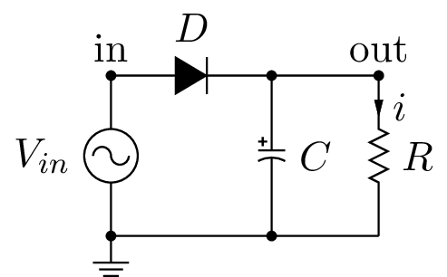
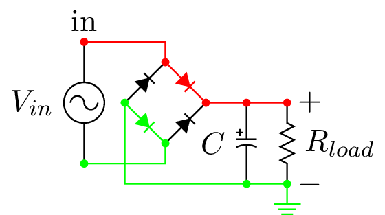
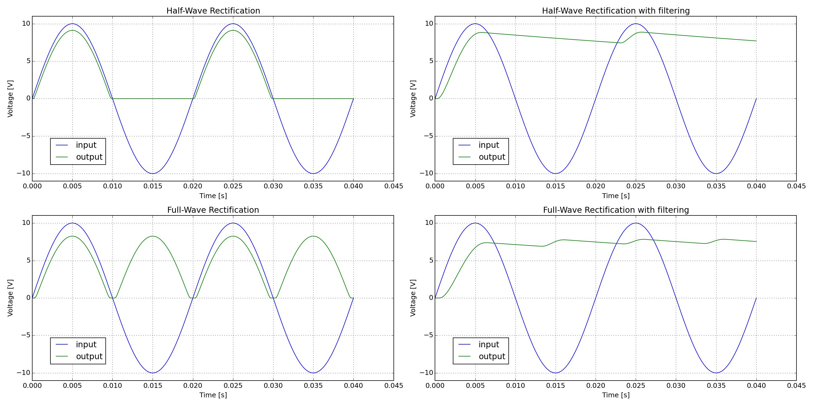

===============
 Rectification
===============

This example depicts half and full wave rectification.

.. code-block:: python

    
    # -*- coding: utf-8 -*-

    
    
    import os
    
    import matplotlib.pyplot as plt
    
    
    import PySpice.Logging.Logging as Logging
    logger = Logging.setup_logging()
    
    
    from PySpice.Probe.Plot import plot
    from PySpice.Spice.Library import SpiceLibrary
    from PySpice.Spice.Netlist import Circuit
    from PySpice.Unit.Units import *
    
    
    libraries_path = os.path.join(os.environ['PySpice_examples_path'], 'libraries')
    spice_library = SpiceLibrary(libraries_path)
    
    
    figure = plt.figure(1, (20, 10))
    
    
    circuit = Circuit('half-wave rectification')
    circuit.include(spice_library['1N4148'])
    source = circuit.Sinusoidal('input', 'in', circuit.gnd, amplitude=10, frequency=50)
    circuit.X('D1', '1N4148', 'in', 'output')
    circuit.R('load', 'output', circuit.gnd, 100)
    
    simulator = circuit.simulator(temperature=25, nominal_temperature=25)
    analysis = simulator.transient(step_time=source.period/200, end_time=source.period*2,
                                   probes=('V(in)', 'V(output)'))
    
    axe = plt.subplot(221)
    plt.title('Half-Wave Rectification')
    plt.xlabel('Time [s]')
    plt.ylabel('Voltage [V]')
    plt.grid()
    plot(analysis['in'], axis=axe)
    plot(analysis.output, axis=axe)
    plt.legend(('input', 'output'), loc=(.05,.1))
    plt.ylim(-source.amplitude*1.1, source.amplitude*1.1)
    
    

.. code-block:: python

    
    circuit.C('1', 'output', circuit.gnd, milli(1))
    
    simulator = circuit.simulator(temperature=25, nominal_temperature=25)
    analysis = simulator.transient(step_time=source.period/200, end_time=source.period*2,
                                   probes=('V(in)', 'V(output)'))
    
    axe = plt.subplot(222)
    plt.title('Half-Wave Rectification with filtering')
    plt.xlabel('Time [s]')
    plt.ylabel('Voltage [V]')
    plt.grid()
    plot(analysis['in'], axis=axe)
    plot(analysis.output, axis=axe)
    plt.legend(('input', 'output'), loc=(.05,.1))
    plt.ylim(-source.amplitude*1.1, source.amplitude*1.1)
    
    
    circuit = Circuit('half-wave rectification')
    circuit.include(spice_library['1N4148'])
    source = circuit.Sinusoidal('input', 'in', circuit.gnd, amplitude=10, frequency=50)
    circuit.X('D1', '1N4148', 'in', 'output_plus')
    circuit.R('load', 'output_plus', 'output_minus', 100)
    circuit.X('D2', '1N4148', 'output_minus', circuit.gnd)
    circuit.X('D3', '1N4148', circuit.gnd, 'output_plus')
    circuit.X('D4', '1N4148', 'output_minus', 'in')
    
    simulator = circuit.simulator(temperature=25, nominal_temperature=25)
    analysis = simulator.transient(step_time=source.period/200, end_time=source.period*2,
                                   probes=('V(in)', 'V(output_minus)', 'V(output_plus)'))
    
    axe = plt.subplot(223)
    plt.title('Full-Wave Rectification')
    plt.xlabel('Time [s]')
    plt.ylabel('Voltage [V]')
    plt.grid()
    plot(analysis['in'], axis=axe)
    plot(analysis.output_plus - analysis.output_minus, axis=axe)
    plt.legend(('input', 'output'), loc=(.05,.1))
    plt.ylim(-source.amplitude*1.1, source.amplitude*1.1)
    
    

.. code-block:: python

    
    circuit.C('1', 'output_plus', 'output_minus', milli(1))
    
    simulator = circuit.simulator(temperature=25, nominal_temperature=25)
    analysis = simulator.transient(step_time=source.period/200, end_time=source.period*2,
                                   probes=('V(in)', 'V(output_minus)', 'V(output_plus)'))
    
    axe = plt.subplot(224)
    plt.title('Full-Wave Rectification with filtering')
    plt.xlabel('Time [s]')
    plt.ylabel('Voltage [V]')
    plt.grid()
    plot(analysis['in'], axis=axe)
    plot(analysis.output_plus - analysis.output_minus, axis=axe)
    plt.legend(('input', 'output'), loc=(.05,.1))
    plt.ylim(-source.amplitude*1.1, source.amplitude*1.1)
    
    
    plt.tight_layout()
    plt.show()
    

