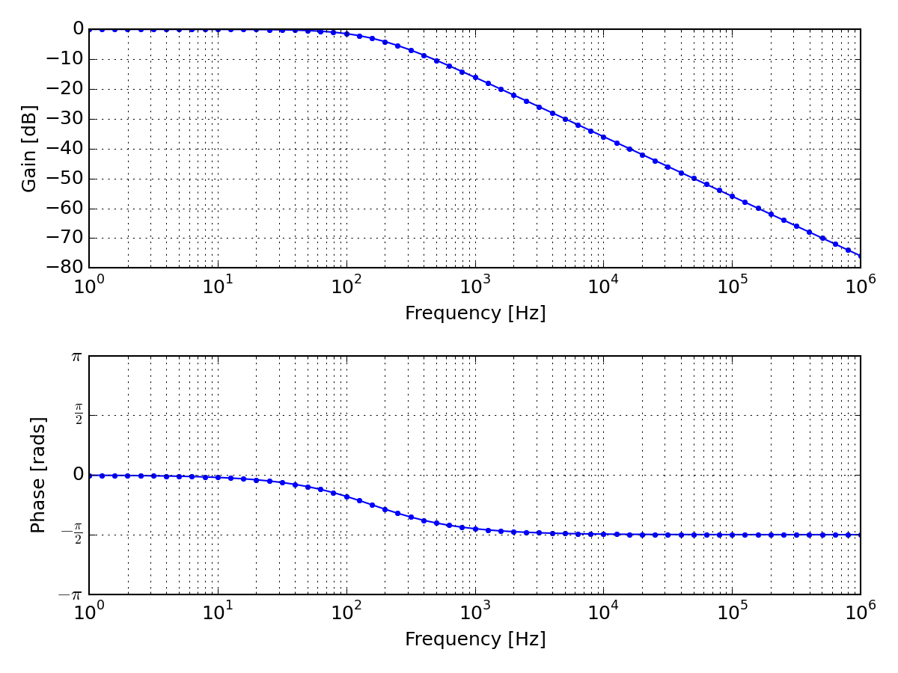

.. include:: /project-links.txt
.. include:: /abbreviation.txt

====================
 Low Pass Rc Filter
====================

.. getthecode:: low-pass-rc-filter.py
    :language: python

.. code-block:: python

    import numpy as np
    import matplotlib.pyplot as plt
    
    import PySpice.Logging.Logging as Logging
    logger = Logging.setup_logging()
    
    from PySpice.Plot.BodeDiagram import bode_diagram
    from PySpice.Spice.Netlist import Circuit
    from PySpice.Unit.Units import *
    
    circuit = Circuit('Low-Pass RC Filter')
    
    circuit.Sinusoidal('input', 'in', circuit.gnd, amplitude=1)
    circuit.R('f', 'in', 'out', kilo(1))
    circuit.C('f', 'out', circuit.gnd, micro(1))
    
    simulator = circuit.simulator(temperature=25, nominal_temperature=25)
    analysis = simulator.ac(start_frequency=1, stop_frequency=mega(1), number_of_points=10,  variation='dec')
    
    print(analysis.out)
    
    figure = plt.figure(1, (20, 10))
    plt.title("Bode Diagram of a Low-Pass RC Filter")
    bode_diagram(axes=(plt.subplot(211), plt.subplot(212)),
                 frequency=analysis.frequency,
                 gain=20*np.log10(np.absolute(analysis.out)),
                 phase=np.angle(analysis.out, deg=False),
                 marker='.',
                 color='blue',
                 linestyle='-',
             )
    plt.tight_layout()
    plt.show()

