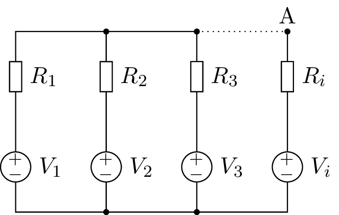
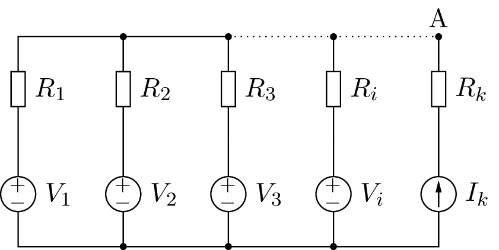

.. include:: /project-links.txt
.. include:: /abbreviation.txt

.. getthecode:: millman-theorem.py
    :language: python

===================
 Millman's theorem
===================

Millman's theorem is a method to compute the voltage of a node in such circuits:

The voltage at node A is:

.. math::

    V_A = \frac{\sum \frac{V_i}{R_i}}{\sum \frac{1}{R_i}}

We can extend this theorem to branches with current sources:

.. math::

    V_A = \frac{\sum \frac{V_i}{R_i} + \sum I_k}{\sum \frac{1}{R_i}}

Note voltage sources can be null and resistances in current's branches don't change the denominator.

.. code-block:: python

    import PySpice.Logging.Logging as Logging
    logger = Logging.setup_logging()
    
    import numpy as np
    
    from PySpice.Spice.Netlist import Circuit
    from PySpice.Unit.Units import *
    
    circuit = Circuit("Millman's theorem")
    
    number_of_branches = 3
    for i in range(1, number_of_branches +1):
        circuit.V('input%u' % i, i, circuit.gnd, i)
        circuit.R(i, i, 'A', kilo(i))
    
    simulator = circuit.simulator(temperature=25, nominal_temperature=25)
    analysis = simulator.operating_point()
    
    node_A = analysis.A
    print('Node {}: {:5.2f} V'.format(str(node_A), float(node_A)))

.. literalinclude:: millman-theorem.stdout
    :lines: 1-1

.. code-block:: python

    branch_voltages = np.arange(1, number_of_branches +1)
    branch_resistances = branch_voltages * float(kilo(1))
    conductances = 1 / branch_resistances
    voltage_A = np.sum(branch_voltages * conductances) / np.sum(conductances)
    print('V(A) = {:5.2f} V'.format(voltage_A))

.. literalinclude:: millman-theorem.stdout
    :lines: 4-4

.. code-block:: python

    # with current sources
    for i in range(1, number_of_branches +1):
        ii = number_of_branches + i
        circuit.I('input%u' % i, circuit.gnd, ii, micro(100*i))
        circuit.R(ii, ii, 'A', kilo(i))
    
    simulator = circuit.simulator(temperature=25, nominal_temperature=25)
    analysis = simulator.operating_point()
    
    node_A = analysis.A
    print('Node {}: {:5.2f} V'.format(str(node_A), float(node_A)))

.. literalinclude:: millman-theorem.stdout
    :lines: 7-7

.. code-block:: python

    branch_currents = np.arange(1, number_of_branches +1) * float(micro(100))
    voltage_A += np.sum(branch_currents) / np.sum(conductances)
    print('V(A) = {:5.2f} V'.format(voltage_A))

.. literalinclude:: millman-theorem.stdout
    :lines: 10-10

