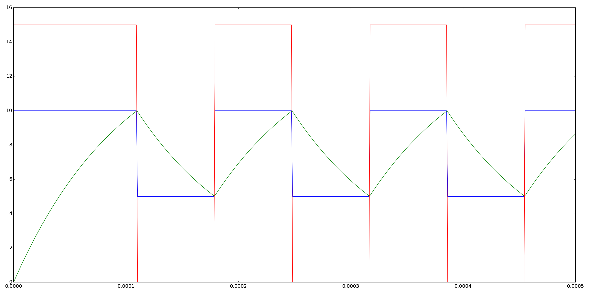

.. include:: /project-links.txt
.. include:: /abbreviation.txt

=========
 Astable
=========

.. getthecode:: astable.py
    :language: python

.. code-block:: python

    import matplotlib.pyplot as plt
    
    import PySpice.Logging.Logging as Logging
    logger = Logging.setup_logging()
    
    from PySpice.Probe.Plot import plot
    from PySpice.Spice.Netlist import Circuit
    from PySpice.Unit.Units import *
    
    # from OperationalAmplifier import basic_comparator
    
    circuit = Circuit('Astable Multivibrator')
    
    source = circuit.V('cc', 'vcc', circuit.gnd, 15)
    # Time constant
    circuit.R(1, 'output', 'comparator', kilo(1))
    circuit.C(1, 'comparator', circuit.gnd, nano(100))
    # Reference
    circuit.R(2, 'output', 'reference', kilo(100))
    circuit.R(3, 'vcc', 'reference', kilo(100))
    circuit.R(4, 'reference', circuit.gnd,  kilo(100))
    # Comparator
    # Fixme: ngspice is buggy with such subcircuit
    # circuit.subcircuit(basic_comparator)
    # circuit.X('comparator', 'BasicComparator', 'reference', 'comparator', 'vcc', circuit.gnd, 'output')
    circuit.NonLinearVoltageSource(1, 'output', circuit.gnd,
                                   expression='V(reference, comparator)',
                                   table=((-micro(1), 0),
                                          (micro(1), source.dc_value))
                                   )
    
    simulator = circuit.simulator(temperature=25, nominal_temperature=25)
    simulator.initial_condition(comparator=0) # Fixme: simulator.nodes.comparator == 0
    analysis = simulator.transient(step_time=micro(1), end_time=micro(500))
    
    figure = plt.figure(1, (20, 10))
    plot(analysis.reference)
    plot(analysis.comparator)
    plot(analysis.output)
    plt.tight_layout()
    plt.show()

