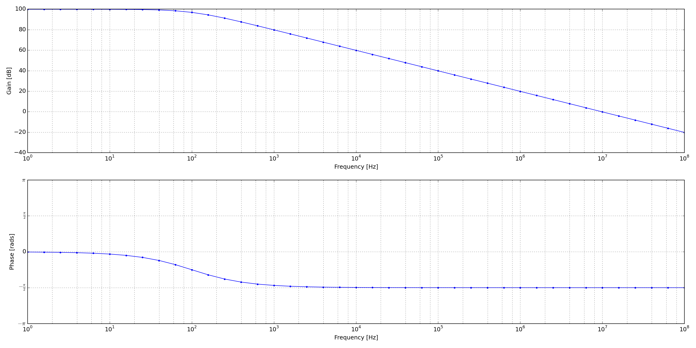

.. include:: /project-links.txt
.. include:: /abbreviation.txt

=======================
 Operational Amplifier
=======================

.. getthecode:: operational-amplifier.py
    :language: python

.. code-block:: python

    import numpy as np
    
    import matplotlib.pyplot as plt
    
    import PySpice.Logging.Logging as Logging
    logger = Logging.setup_logging()
    
    from PySpice.Plot.BodeDiagram import bode_diagram
    from PySpice.Probe.Plot import plot
    from PySpice.Spice.Netlist import Circuit
    from PySpice.Unit.Units import *
    
    from OperationalAmplifier import BasicOperationalAmplifier
    
    circuit = Circuit('Operational Amplifier')
    
    # AC 1 PWL(0US 0V  0.01US 1V)
    circuit.Sinusoidal('input', 'in', circuit.gnd, amplitude=1)
    circuit.subcircuit(BasicOperationalAmplifier())
    circuit.X('op', 'BasicOperationalAmplifier', 'in', circuit.gnd, 'out')
    circuit.R('load', 'out', circuit.gnd, 470)
    
    simulator = circuit.simulator(temperature=25, nominal_temperature=25)
    analysis = simulator.ac(start_frequency=1, stop_frequency=mega(100), number_of_points=5,  variation='dec')
    
    figure = plt.figure(1, (20, 10))
    plt.title("Bode Diagram of an Operational Amplifier")
    bode_diagram(axes=(plt.subplot(211), plt.subplot(212)),
                 frequency=analysis.frequency,
                 gain=20*np.log10(np.absolute(analysis.out)),
                 phase=np.angle(analysis.out, deg=False),
                 marker='.',
                 color='blue',
                 linestyle='-',
                )
    plt.tight_layout()
    plt.show()

