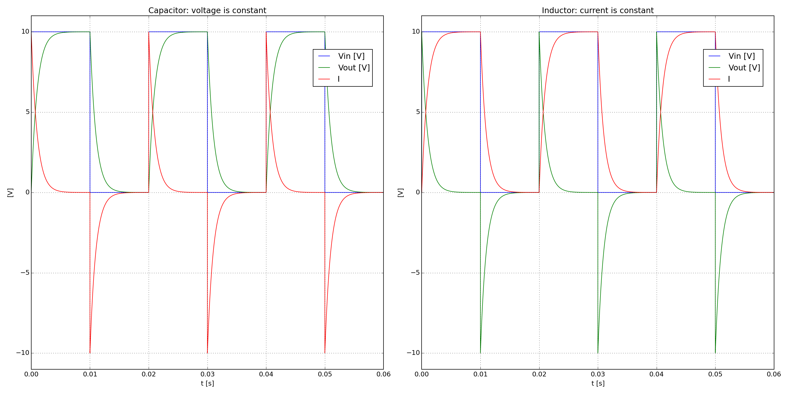

.. include:: /project-links.txt
.. include:: /abbreviation.txt

====================
 Capacitor Inductor
====================

.. getthecode:: capacitor-inductor.py
    :language: python

.. code-block:: python

    import matplotlib.pyplot as plt
    
    import PySpice.Logging.Logging as Logging
    logger = Logging.setup_logging()
    
    from PySpice.Probe.Plot import plot
    from PySpice.Spice.Netlist import Circuit
    from PySpice.Unit.Units import *
    
    # Warning: the capacitor/inductor return current in the generator
    #  could use switches instead
    
    figure = plt.figure(1, (20, 10))
    
    for element_type in 'capacitor', 'inductor':
    
        circuit = Circuit(element_type.title())
        # Fixme: compute value
        source = circuit.Pulse('input', 'in', circuit.gnd,
                               initial_value=0, pulsed_value=10,
                               pulse_width=milli(10), period=milli(20))
        circuit.R(1, 'in', 'out', kilo(1))
        if element_type == 'capacitor':
            element = circuit.C
            value = micro(1) # F
            # tau = RC = 1 ms
        else:
            element = circuit.L
            value = 1 # H
            # tau = L/R = 1 ms
        element(1, 'out', circuit.gnd, value)
        # circuit.R(2, 'out', circuit.gnd, kilo(1)) # for debug
    
        if element_type == 'capacitor':
            print('tau = ', float(circuit['R1'].resistance) * float(circuit['C1'].capacitance ))
        else:
            print('tau = ', float(circuit['L1'].inductance) / float(circuit['R1'].resistance))
    
        simulator = circuit.simulator(temperature=25, nominal_temperature=25)
        analysis = simulator.transient(step_time=micro(1), end_time=source.period*3)
    
        if element_type == 'capacitor':
            axe = plt.subplot(121)
            title = "Capacitor: voltage is constant"
        else:
            axe = plt.subplot(122)
            title = "Inductor: current is constant"
        axe.set_title(title)
        axe.grid()
        current_scale = 1000
        plot(analysis['in'])
        plot(analysis['out'])
        # Fixme: resistor current, scale
        plot((analysis['in'] - analysis.out)/float(circuit['R1'].resistance)*current_scale)
        axe.set_ylim(-11, 11)
        axe.set_xlabel('t [s]')
        axe.set_ylabel('[V]')
        axe.legend(('Vin [V]', 'Vout [V]', 'I'), loc=(.8,.8))
    
    plt.tight_layout()
    plt.show()

