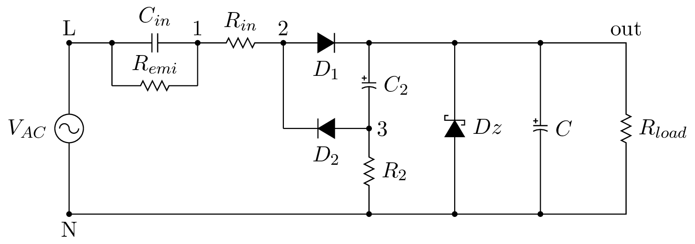
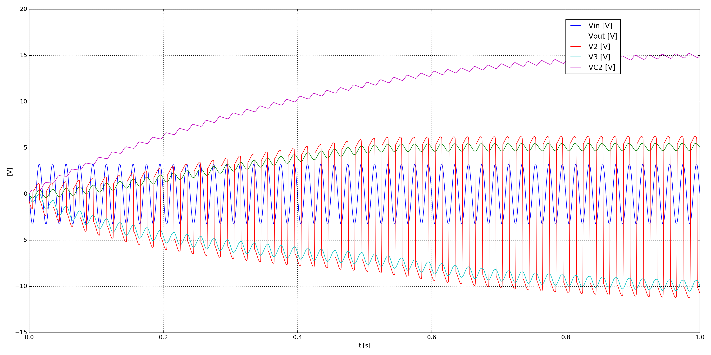

.. include:: /project-links.txt
.. include:: /abbreviation.txt

==============================================
 Capacitive Half Wave Rectification Pre Zener
==============================================

.. getthecode:: capacitive-half-wave-rectification-pre-zener.py
    :language: python

This example shows a capacitive power supply with a pre zener half-rectification.

.. code-block:: python

    import os
    
    import matplotlib.pyplot as plt
    
    import PySpice.Logging.Logging as Logging
    logger = Logging.setup_logging()
    
    from PySpice.Probe.Plot import plot
    from PySpice.Spice.Library import SpiceLibrary
    from PySpice.Spice.Netlist import Circuit
    from PySpice.Unit.Units import *
    
    libraries_path = os.path.join(os.path.dirname(os.path.dirname(__file__)), 'libraries')
    spice_library = SpiceLibrary(libraries_path)
    

.. code-block:: python

    circuit = Circuit('Capacitive Half-Wave Rectification (Pre Zener)')
    
    circuit.include(spice_library['1N4148'])
    # 1N5919B: 5.6 V, 3.0 W Zener Diode Voltage Regulator
    circuit.include(spice_library['d1n5919brl'])
    
    ac_line = circuit.AcLine('input', circuit.gnd, 'L', rms_voltage=230, frequency=50)
    circuit.C('in', 'L', 1, nano(330))
    circuit.R('emi', 'L', 1, kilo(165))
    circuit.R('in', 1, 2, 2*47)
    circuit.X('D1', '1N4148', 2, 'out')
    circuit.C('2', 'out', 3, micro(250))
    circuit.R('2', 3, circuit.gnd, kilo(1))
    circuit.X('D2', '1N4148', 3, 2)
    circuit.X('Dz', 'd1n5919brl', circuit.gnd, 'out')
    circuit.C('', circuit.gnd, 'out', micro(250))
    circuit.R('load', circuit.gnd, 'out', kilo(1))
    
    # # Fixme: circuit.nodes[2].v, circuit.branch.current
    # print circuit.nodes
    
    # Simulator(circuit, ...).transient(...)
    simulator = circuit.simulator(temperature=25, nominal_temperature=25)
    analysis = simulator.transient(step_time=ac_line.period/200, end_time=ac_line.period*50)
    
    figure = plt.figure(1, (20, 10))
    axe = plt.subplot(111)
    
    plot(analysis.L / 100, axis=axe)
    plot(analysis.out, axis=axe)
    
    plot(analysis['2'], axis=axe)
    plot(analysis['3'], axis=axe)
    plot((analysis.out - analysis['3']), axis=axe)
    # plot((analysis['2'] - analysis['3']), axis=axe)
    
    #plot((analysis.L - analysis['1']) / 100, axis=axe)
    
    ###plot((analysis.out - analysis['L']) / 100, axis=axe)
    ###plot(analysis.out - analysis['2'], axis=axe)
    ###plot((analysis['2'] - analysis['1']) / 100, axis=axe)
    # or:
    #   plt.plot(analysis.out.abscissa, analysis.out)
    plt.legend(('Vin [V]', 'Vout [V]', 'V2 [V]', 'V3 [V]', 'VC2 [V]'), loc=(.8,.8))
    plt.grid()
    plt.xlabel('t [s]')
    plt.ylabel('[V]')
    
    plt.tight_layout()
    plt.show()

