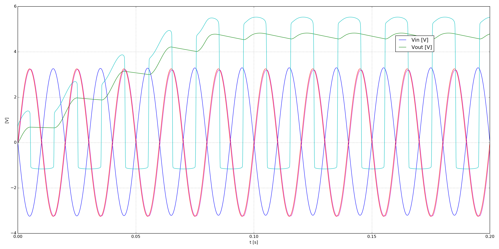

=============================
 Transform Less Power Supply
=============================

.. getthecode:: transform-less-power-supply.py
    :language: python

.. code-block:: python

    import os
    
    import matplotlib.pyplot as plt
    
    import PySpice.Logging.Logging as Logging
    logger = Logging.setup_logging()
    
    from PySpice.Probe.Plot import plot
    from PySpice.Spice.Library import SpiceLibrary
    from PySpice.Spice.Netlist import Circuit
    from PySpice.Unit.Units import *
    
    libraries_path = os.path.join(os.path.dirname(os.path.dirname(__file__)), 'libraries')
    spice_library = SpiceLibrary(libraries_path)
    
    circuit = Circuit('STM AN1476: Low-Cost Power Supply For Home Appliances')
    
    circuit.include(spice_library['1N4148'])
    # 1N5919B: 5.6 V, 3.0 W Zener Diode Voltage Regulator
    circuit.include(spice_library['d1n5919brl'])
    
    ac_line = circuit.AcLine('input', 'out', 'in', rms_voltage=230, frequency=50)
    circuit.R('load', 'out', circuit.gnd, kilo(1))
    circuit.C('load', 'out', circuit.gnd, micro(220))
    circuit.X('D1', '1N4148', circuit.gnd, 1)
    circuit.X('Dz1', 'd1n5919brl', 1, 'out')
    circuit.C('ac', 1, 2, nano(470))
    circuit.R('ac', 2, 'in', 470)
    
    # # Fixme: circuit.nodes[2].v, circuit.branch.current
    # print circuit.nodes
    
    # Simulator(circuit, ...).transient(...)
    simulator = circuit.simulator(temperature=25, nominal_temperature=25)
    analysis = simulator.transient(step_time=ac_line.period/200, end_time=ac_line.period*10)
    
    figure = plt.figure(1, (20, 10))
    axe = plt.subplot(111)
    
    plot(analysis['in'] / 100, axis=axe)
    plot(analysis.out, axis=axe)
    plot((analysis.out - analysis['in']) / 100, axis=axe)
    plot(analysis.out - analysis['1'], axis=axe)
    plot((analysis['1'] - analysis['2']) / 100, axis=axe)
    # or:
    #   pylab.plot(analysis.out.abscissa, analysis.out)
    plt.legend(('Vin [V]', 'Vout [V]'), loc=(.8,.8))
    plt.grid()
    plt.xlabel('t [s]')
    plt.ylabel('[V]')
    
    plt.tight_layout()
    plt.show()

