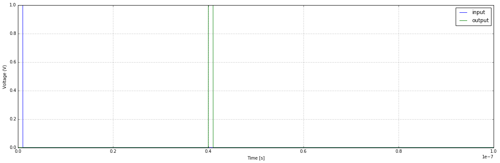

.. include:: /project-links.txt
.. include:: /abbreviation.txt

===============================================
True-time Delay with Lossless Transmission Line
===============================================

.. getthecode:: time_delay.py
    :language: python

.. code-block:: python

    import PySpice.Logging.Logging as Logging
    from PySpice.Spice.Netlist import Circuit
    import matplotlib.pyplot as plt
    from PySpice.Probe.Plot import plot

    logger = Logging.setup_logging()

    ####################################################################################################

    circuit = Circuit('Transmission Line')
    circuit.Pulse('pulse', 'input', circuit.gnd, 0, 1, 1e-9, 1e-6)
    circuit.R('load', 'output', circuit.gnd, 50)
    circuit.TransmissionLine('delay', 'input', circuit.gnd, 'output', circuit.gnd, impedance=50, time_delay=40e-9)

    simulator = circuit.simulator(temperature=25, nominal_temperature=25)
    analysis = simulator.transient(step_time=1e-11, end_time=100e-9)

    ####################################################################################################

    plt.figure(None, (20, 6))
    plot(analysis['input'])
    plot(analysis['output'])
    plt.xlabel('Time [s]')
    plt.ylabel('Voltage (V)')
    plt.grid()
    plt.legend(['input', 'output'], loc='upper right')
    plt.show()

